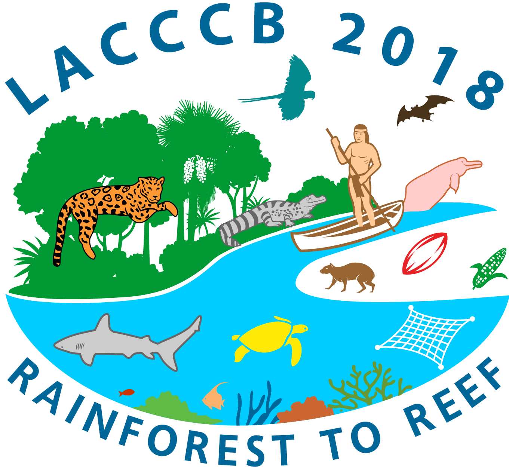

# LACCCB 2018

First Latin American and Caribbean Congress for Conservation Biology. St. Augustine, Trinidad & Tobago, 2018. [Conference web page](https://lacccb2018.org/)

## Logo

{width=300}{.preview-image}

## Contribuciones

Ponencia: "Risk of ecosystem collapse under different scenarios of management as a measure of conservation opportunities and challenges" José R. Ferrer-Paris

Presentada en el simposio “[An Insight into the Orinoco Mining Arc: its implications for Venezuela and the eastern Caribbean](https://lacccb2018.org/orinoco-mining-arc)”, organizado por la Sociedad Venezolana de Ecología.

Durante la conferencia también contribuí junto a varios asistentes del congreso a preparar la [Declaración de la conferencia](https://lacccb2018.org/orinoco-mining-arc-conference-statement), la cual fue aprobada en la reunión de los miembros de LACA.

```{r}
eventos <- c("Eventos - CEBA LEE", "Eventos - RLE", "Eventos - Venezuela", "Eventos - Mariposas", "Eventos - IVIC")
slc <- "LACCCB"
```


```{r}
library(pixture)
library(dplyr)
here::i_am("evnts/2018_AbuDhabi.qmd")
source(here::here("inc", "functions.R"))
```


```{r}
#| output: asis
gphotos <- filter_ggl_photo(description = slc, 
  album_name = eventos) |>
  pull_ggle_paths_captions(howmany = 1, preview=TRUE)

htmlcode <- "<center>\n%s\n<br/>\n%s<br/></center>"

show_photo <- sprintf(htmlcode, gphotos$paths, gphotos$captions)
cat(show_photo)
```


## Galería de fotos

```{r}
gphotos <- filter_ggl_photo(description = slc, 
  album_name = eventos) |>
  pull_ggle_paths_captions()
pixgallery(gphotos$paths, caption=gphotos$captions)
```
