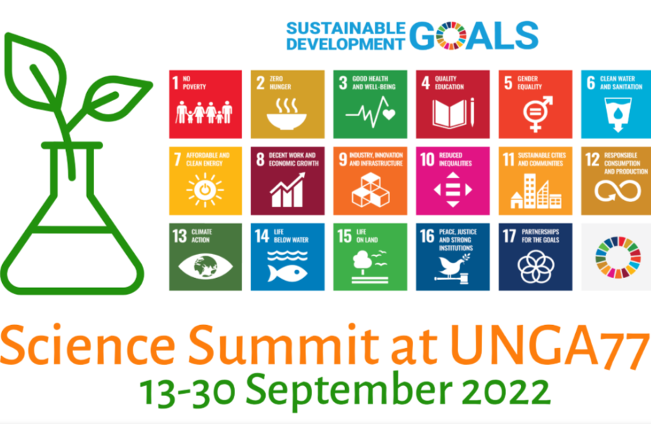

# El evento 

Science Summit at the 77 United Nation General Assembly. 13-30 Septiembre 2022

## Logo

## Enlaces

- [Página Web](https://sciencesummitunga.com)
- [Conclusions](https://sciencesummitunga.com/conclusions-unga-77/)
- [Agenda](https://ssunga77.sched.com/?iframe=yes&w=100%&sidebar=yes&bg=no#)
- <a href='https://docs.google.com/presentation/d/1P7sC9mU0PgpeY0M5wRZsi8EeUxhbB97_/edit?usp=sharing&ouid=101417701421011377285&rtpof=true&sd=true'>Presentación del evento</a>

## Participación y productos relacionados

Participé en un panel de expertos de Latino América para discutir el progreso de las evaluaciones de riesgo de colapso de ecosistemas en el continente y compartir lecciones aprendidas.

> La Lista Roja de Ecosistemas de la UICN: oportunidades y desafíos para apoyar el marco post 2020 y los Objetivos de Desarrollo Sostenible en América Latina. Panel de discusión. Evento virtual.  Septiembre 21 

