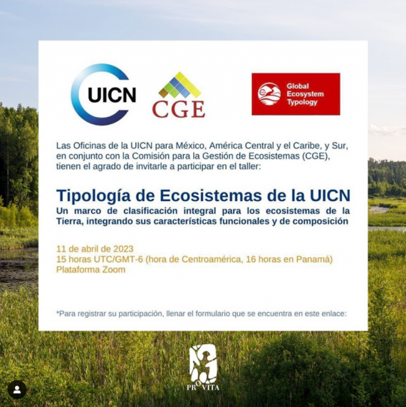

# Evento

Las oficinas de la UICN de México, América Central y el Caribe y América del Sur en alianza con la UICN Comisión para la Gestión de Ecosistemas organizó un taller sobre la Tipología de Ecosistemas de la UICN. La sesión se llevó a cabo en español el 11 de abril a las 4:00pm (GMT +5). 

{.preview-image}

## Ponencia 

**TIPOLOGÍA GLOBAL DE ECOSISTEMAS DE LA UICN: Un marco de clasificación integral para los ecosistemas de la tierra, integrando sus características funcionales y de composición**. Seminario virtual UICN Comisión para la Gestión de Ecosistemas, 11 Abril 2023. Presentado por: JR Ferrer-Paris @ UNSW Sydney. [Presentación disponible en RPubs](https://rpubs.com/jrfep/GET-seminario-virtual)

Relacionado con nuestro trabajo sobre la tipología global de ecosistemas [@Keith_2020_Ecosystem_Typology; @Keith_2022_Ecosystem_Typology].

