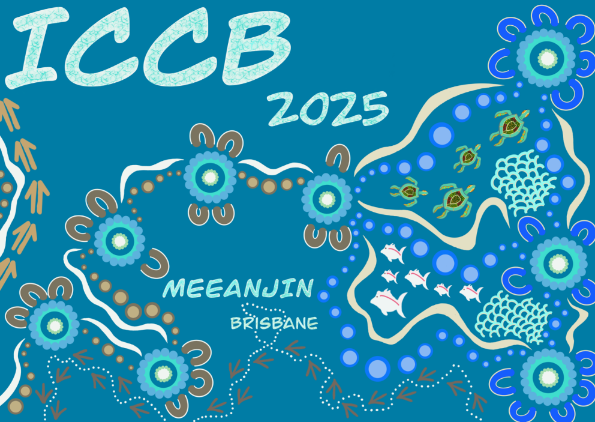

# ICCB 2025

SCB's 32nd International Congress for Conservation Biology (ICCB 2025) will take place in Brisbane/Meanjin, Australia at the Brisbane Convention & Exhibition Centre (BCEC) from 15-19 June 2025! 

## Logo del evento

{.preview-image}

## Enlaces

- [Philosophy statement](https://conbio.org/mini-sites/iccb-2025/about/philosophy-statement)

Abstract ID Number: 626
Title: Quantifying and managing risks to ecosystems: Australia through a global lens
Primary Author Name: David Keith

> Targets to halt ecosystem declines, restore degraded ecosystems and protect natural ecosystems were agreed under the UN Kunming-Montreal Global Biodiversity Framework. The IUCN Red List of Ecosystems (RLE), framing conservation around risk reduction, is one of two agreed Headline Indicators by which progress will be reported. Increasing numbers of countries are developing comprehensive national Red Lists to inform their strategies and priorities for risk reduction and report on the outcomes; some already have time series of Red List updates spanning two decades. Despite its longstanding statutory framework for listing threatened ecological communities, scientific leadership in development of methods and a wealth of relevant data, Australia lags behind leading countries. Three foundational challenges confront us. First, Australia’s detailed vegetation inventory needs ecological integration with the IUCN Global Ecosystem Typology. Progress has been initiated in 2024 via commitments to ecosystem accounting, but cross-jurisdictional consistency remains challenging for national synthesis. Less detailed data exist for most freshwater and marine ecosystems, but legacies of inconsistencies are less acute. Second, informative time series are needed for ecosystem-specific insights into drivers and mechanisms of ecosystem change. Generic environmental indices and landcover have proved inadequate to this task. Third, sustainable workflows are needed to periodically update the risk assessments, drawing on broadly based communities of experts for parameterisation and critical review. The vision is to develop a sustainable information stream on which ecosystems are most at risk, where, how to reduce the risks and report on progress. South Africa, Finland and other nations show us how.